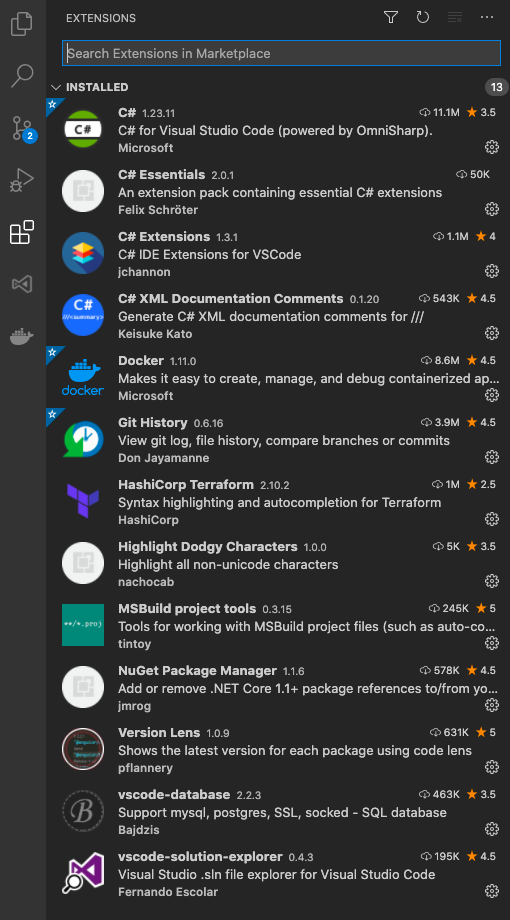
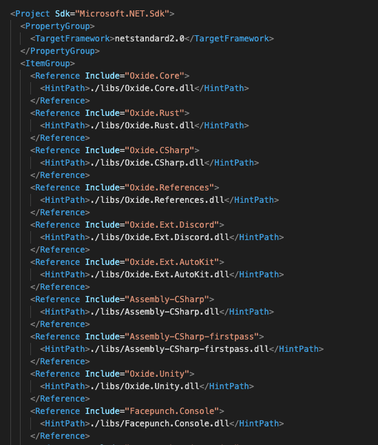
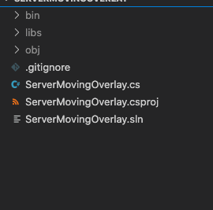

# Developing plugins for Rust

## Helpful Tools

Tool or Guide  | Purpose
-------------- | -------
[ILSpy (Linux/OSX)](https://github.com/icsharpcode/ILSpy) | Decompiling Rust Server and Oxide Assemblies.
[DotPeek (Windows)](https://www.jetbrains.com/decompiler/) | Same as above, just for windows.
[Oxide/UMod](https://github.com/OxideMod/Oxide.Rust/releases) | Open source modding framework, and location for latest releases for Windows and Linux
[Oxide/UMod Rust API Documentation](https://umod.org/documentation/games/rust) | Documentation for working with Umod in rust. 
[Oxide/Umod Permissions System](https://umod.org/documentation/plugins/permissions) | Documentation for the permissions sytem Oxide creates for Rust.
[Dotnet Framework (X-Platform)](https://dotnet.microsoft.com/download) | The Dotnet framework needed to create C# projects for rust. 
[MSBuild (X-Platform)](https://github.com/dotnet/msbuild) | MSBuild for building your dotnet projects.
[OmniSharp (VSCode)](https://github.com/OmniSharp/omnisharp-vscode) | JIT compiler and Intellisense for VSCode
[Running a Rust Server](https://www.rustafied.com/how-to-host-a-rust-server-in-linux) | Guide to running a Rust server in Linux. 

## Visual Studio Setup and Extensions
See the configuration `settings.json` file under configuration in this repository. 



## Anatomy of a Rust Plugin project
I use Visual Studio Code on OSX and Linux with dotnet and msbuild; See the reference links above. 



I recommend downloading all of the Oxide/UMOD assemblies into a central location and symlinking it into your project directory. 



Don't forget to include a .gitignore and make sure to ignore the libs directory for the assemblies you've symlinked. Follow the guide to spinning up a rust server and you can take 
all of the assemblies provided in RustDedicated_Data/Managed and drop them *FIRST* into your centralized assembly location. Once you've done that, you can then extract the UMOD 
assemblies over this directory and it will overwrite what it needs to. 

```C#
using Oxide.Core;
using Oxide.Core.Plugins;
using Oxide.Game.Rust.Cui;
using UnityEngine;

namespace Oxide.Plugins
{
    [Info( "Neato New Plugin", "you", "0.1" )]
    [Description( "Idk something cool" )]
    class NeatoNewPlugin : RustPlugin
    {
```

The above is an example of the decorators that need to be present on a Rust plugin in order for Oxide to recognize it and load it into the game. With Intellisense setup you should 
be able to work with most objects right in your editor, but you may need to leverage DotPeek or ILSpy to dig deeply into some of the server assemblies to accomplish what you want.

Beyond this you'll be leveraging hooks provided by the Umod api and working with the Rust Server assemblies themselves. 

Example ChatCommand:

```C#
[ChatCommand( "autobuy" ), Permission( UsePermission )]
void AutoBuyCommand( BasePlayer player, string command, string[] args )
{
    try
    {
        var run = args.ElementAtOrDefault( 0 ) ?? "gui";
        var kitName = args.ElementAtOrDefault( 1 ) ?? run;
        var kitConfiguration = new AutoBuyKitConfiguration();
        incompleteKitConfigurations.Add( kitConfiguration );
        switch ( run )
        {
            case "save":
                autoKit.With( player, ( action ) => action.WithNewKit( kitName ).Save( Save ).Notify() );
                autoKit.Save();
                break;
```

Example ConsoleCommand

```C#
[ConsoleCommand( "autobuy.kitname" ), Permission( UsePermission )]
void KitNameCommand( ConsoleSystem.Arg arg )
{
    BasePlayer player = arg.Player();
                
```

I'm not going to go into detail the difference beteween a RustPlugin and a CovalencePlugin, but they are different. Covalence plugins are part of the next step forward with 
umod/universal mod and abstract away the game specific details allowing you to write plugins that work for all games that support umod. I have written several Covalence plugins 
but for the point of this simple getting started, these are the basics of a normal Rust plugin. 

## Starting a new Rust plugin project. 

```bash
mkdir my-new-plugin
cd my-new-plugin
dotnet new sln
```

Next you'll want to create and populate a `.csproj` file with the same name as your solution. Add the assemblies you're going to need to develop this plugin, most often you will 
end up using the Oxide assemblies more than the Rust server assemblies. Take a look at my example `.csproj` file screenshot above to get an idea of what you'll be using.

```bash
dotnet sln my-new-plugin.sln add my-new-plugin.csproj
touch my-new-plugin.cs
```

Now you're ready to start developing a plugin. 

## Oxide Permissions System

Not the Permissions I setup on some of the commands above. It's important when developing plugins that if you're giving a user access to a specific command or functionality of the 
plugin that you setup permissions for this. There are a lot of benefits to doing so but most importantly it allows you to granularly control the access to the plugins intentions. 
For example if you were writing a plugin that made a web request to do something with the data it presents  you don't want to give everyone access to this, as they can just hammer 
it with a macro or do nefarious things. See documentation around Umod in the links above to get a good feel for best practices. 

## Creating Rust plugin Assemblies for Extensions

As of right now Wulf/Luke (creator of Umod) is not a proponent of writing extensions and with the release of the new umod underway i'll hold off for now... 


## Final Thoughts

I'll continue adding to this if I find relevant or important things or whatever feedback I get from others using it. Right now i'll keep it simple to hopefully help someone get on 
their way to developing a plugin. 

